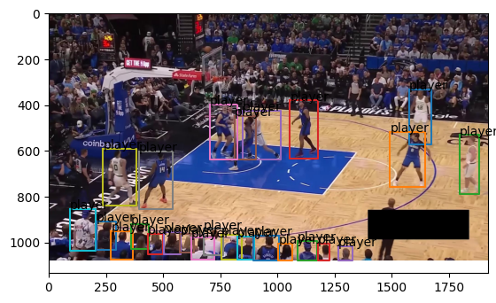
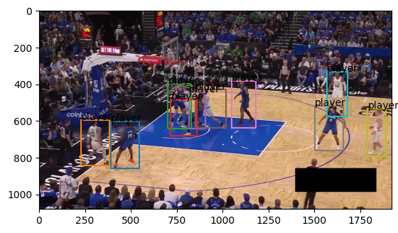

# Moondream Fine-tuning

A repository for fine-tuning Moondream vision-language models using supervised and reinforcement learning approaches.

These trainers are focused on improving the model's ability to detect and localize objects in images, but in the future we can add the other tasks Moondream can do.

So far using this codebase, I've been able to improve the model's f1 score on a held out test set of detecting basketball players by 11%.

## Sample Results

| Before                       | After                      |
| ---------------------------- | -------------------------- |
|  |  |

### Warning:

This code works best for Moondream 2, and the teacher forced trainer (`sft_trainer.py`).

## Setup

### 1. Install Dependencies

```bash
pip install -r requirements.txt
```

### 2. Download Base Model(s)

Download the Moondream 2 base model from Hugging Face:

```bash
wget https://huggingface.co/vikhyatk/moondream2/resolve/main/model.safetensors
mv model.safetensors moondream2/model.safetensors
```

For [Moondream 3](https://huggingface.co/moondream/moondream3-preview), do the same, but place the model at `models/model_md3.safetensors`.

### 3. Prepare Dataset

Any COCO style dataset will work. In this case I wanted to use something relatively difficult for the existing versions of Moondream so we could actually see some improvement. In this case I used the basketball player detection dataset made by RoboFlow. You can download that dataset [here](https://universe.roboflow.com/roboflow-jvuqo/basketball-player-detection-3-ycjdo/browse?queryText=&pageSize=50&startingIndex=0&browseQuery=true).

Place that (or any other COCO style dataset) in the `datasets/{dataset_name}/` directory.

## Trainers

### 1. SFT Trainer (`sft_trainer.py`)

Teacher-forced region fine-tuning that follows the generative detection path exactly as used during inference for more aligned training. Supports optional LoRA adapters.

**Run with default settings:**

```bash
python sft_trainer.py
```

**Run with custom parameters:**

```bash
python sft_trainer.py --lr=1e-5 --epochs=5 --use_lora=True --grad_accum_steps=16
```

### 2. GRPO Trainer (`grpo_trainer.py`)

Group Relative Policy Optimization (GRPO) trainer that uses reinforcement learning to fine-tune the region head by collecting rollouts and computing rewards based on detection quality.

**Run with default settings:**

```bash
python grpo_trainer.py
```

**Run with custom parameters:**

```bash
python grpo_trainer.py --learning_rate=5e-5 --batch_size=5 --num_rollouts=5 --num_epochs=3
```

## Hyperparameter Search

The following shell script runs a hyperparameter search for the `sft_trainer.py` script:

```bash
./run_hparam_sweep.sh
```

The results are logged to Weights & Biases, and makes it easy to determine which config is best for your dataset.

Note that the `run_hparam_sweep.sh` script is just a wrapper around the `sft_trainer.py` script, so you can modify the script to run your own hyperparameter search.

## Model Loading

See [here](MODEL_ARTIFACTS_README.md).

## References

This work is based on the following repositories and tutorials:

-   [Moondream](https://huggingface.co/vikhyatk/moondream2)
-   [Moondream Region Finetuning](https://github.com/vikhyat/moondream/blob/main/moondream/finetune/finetune_region.py)
-   [GRPO Code](https://www.youtube.com/watch?v=yGkJj_4bjpE)
